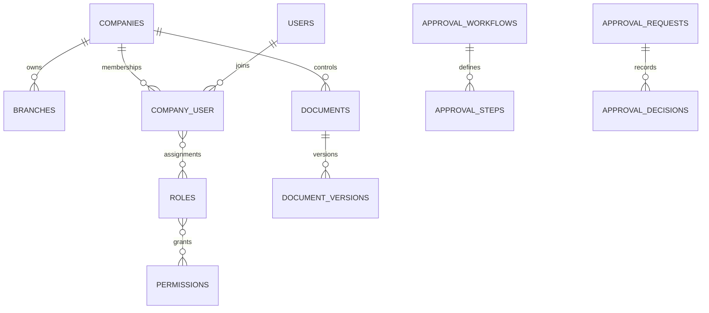

# Implementation Master Plan — Graha Pondasi ERP

Repository diterima kosong pada 21 Agustus 2026. Baseline: Laravel 13.26, PHP 8.3, MySQL 8.4 produksi, Blade/Tailwind, PHPUnit. Tidak ada legacy code/data yang dapat digunakan ulang.

> DECISION REQUIRED BPM-001: `docs/PM 04 Business Process Mapping.xls` tidak tersedia. Master command dipakai sebagai baseline sementara; mapping Level 0 belum final.

| Domain | Ada | Parsial | Belum | Masalah | Prioritas | Tindakan |
|---|---:|---:|---:|---|---|---|
| Organization/IAM | Ya | Ya | Tidak | UI CRUD lanjutan | P0 | Fase 1 |
| Approval/Document/Audit/Numbering | Ya | Ya | Tidak | parallel, quorum, signature | P0 | Fase 1-2 |
| CRM/Tender/Contract | Ya | Ya | Tidak | CRM lanjutan dan signing eksternal | P1 | Perluasan Fase 2 |
| Project/Bored Pile | Ya | Ya | Tidak | schedule/Gantt dan testing lanjutan | P1 | Perluasan Fase 3 |
| Procurement/Inventory | Ya | Ya | Tidak | PO/versioning/three-way match | P1 | Perluasan Fase 4 |
| Manufacturing/Equipment | Ya | Ya | Tidak | UI produksi dan maintenance lanjutan | P2 | Perluasan Fase 5 |
| Finance/Accounting | Ya | Ya | Tidak | AP/AR, pajak, closing UI | P1 | Perluasan Fase 6 |
| QMS/HSE | Ya | Ya | Tidak | HSE forms dan management review UI | P1 | Perluasan Fase 7 |
| Reporting | Ya | Ya | Tidak | dashboard role-based dan export | P2 | Fase 8 |

## Target dan ERD

Modular monolith; domain berkembang di `app/Domain`, shared tenancy/audit di `app/Support` dan `app/Services`. Semua transaksi wajib membawa company dan dimensi relevan.

Roadmap mengikuti delapan fase master command. Migration additive dan backward-compatible; idempotency, row locking, decimal uang, FK constraint, dan authorization backend adalah invariant.

## Log implementasi berkelanjutan

- 2026-08-21: scaffold, schema organisasi/RBAC/governance, company isolation, number sequence, approval sequential, audit hash chain, document version service, branded authentication, organization UI, dan test fondasi.
- Berikutnya: CRUD membership/role matrix, approval parallel/quorum/delegation, registry document UI dan secure download sebelum Fase 2.
- 2026-08-21: approval any/all/quorum, SLA, delegation, reject/revision engine, document registry/download isolation, serta core tender won/lost dan idempotent project conversion.
- Berikutnya: UI tender/estimating dan contract activation gate; rekonsiliasi BPM tetap menunggu workbook.
- 2026-08-21: Fase 3 core project zone/WBS/cost code, bored pile lifecycle, concrete overbreak tolerance, daily report/inspection schema, dan project closing gate.
- 2026-08-21: Fase 4 core item/UOM/warehouse/bin, immutable stock ledger, receipt/issue/transfer idempotent, negative stock prevention, purchase request dan budget gate.
- 2026-08-21: Fase 5 core BOM/production order/material traceability, equipment/hour meter, maintenance schema, fuel consumption dan anomaly flag.
- 2026-08-21: Fase 6 core COA, fiscal period, configurable mappings, balanced/idempotent journal posting, period lock, immutable posted entries dan project cost ledger.
- 2026-08-21: Fase 7 core configurable standard/clause mapping, risk/opportunity, NCR/CAPA, internal audit independence, evidence expiry dan management review schema.
- 2026-08-21: UI operasional QMS, permission backend `qms.*`, company isolation, risk scoring, NCR/CAPA dan audit independence diverifikasi; 27 test/69 assertion lulus.
- Berikutnya: Fase 8 dashboard per-role, laporan lintas domain, export, scheduler, security/performance hardening, deployment docs dan screenshot responsive.
- 2026-08-21: Fase 8 core tiga laporan terisolasi company, filter periode, CSV permission, SLA/evidence scheduler dan deployment runbook.
- 2026-08-21: runtime error audit sehat; UI manufacturing, production completion, equipment, hour meter, fuel anomaly dan maintenance work order diaktifkan.
