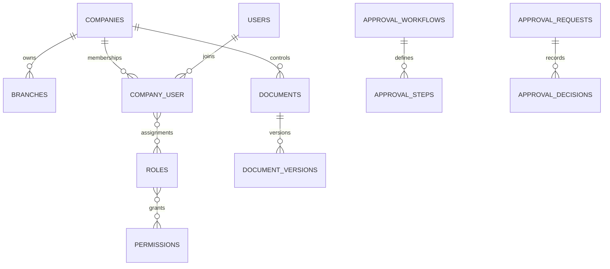

# Implementation Master Plan — Graha Pondasi ERP

Repository diterima kosong pada 21 Agustus 2026. Baseline: Laravel 13.26, PHP 8.3, MySQL 8.4 produksi, Blade/Tailwind, PHPUnit. Tidak ada legacy code/data yang dapat digunakan ulang.

> DECISION REQUIRED BPM-001: `docs/PM 04 Business Process Mapping.xls` tidak tersedia. Master command dipakai sebagai baseline sementara; mapping Level 0 belum final.

| Domain | Ada | Parsial | Belum | Masalah | Prioritas | Tindakan |
|---|---:|---:|---:|---|---|---|
| Organization/IAM | Ya | Ya | Tidak | UI CRUD lanjutan | P0 | Fase 1 |
| Approval/Document/Audit/Numbering | Ya | Ya | Tidak | parallel, quorum, signature | P0 | Fase 1-2 |
| CRM/Tender/Contract | Ya | Ya | Tidak | CRM lanjutan dan signing eksternal | P1 | Perluasan Fase 2 |
| Project/Bored Pile | Ya | Ya | Tidak | schedule/Gantt dan testing lanjutan | P1 | Perluasan Fase 3 |
| Procurement/Inventory | Ya | Ya | Tidak | PO/versioning/three-way match | P1 | Perluasan Fase 4 |
| Manufacturing/Equipment | Ya | Ya | Tidak | UI produksi dan maintenance lanjutan | P2 | Perluasan Fase 5 |
| Finance/Accounting | Ya | Ya | Tidak | AP/AR, pajak, closing UI | P1 | Perluasan Fase 6 |
| QMS/HSE | Ya | Ya | Tidak | HSE forms dan management review UI | P1 | Perluasan Fase 7 |
| Reporting | Ya | Ya | Tidak | dashboard role-based dan export | P2 | Fase 8 |

## Target dan ERD

Modular monolith; domain berkembang di `app/Domain`, shared tenancy/audit di `app/Support` dan `app/Services`. Semua transaksi wajib membawa company dan dimensi relevan.

Roadmap mengikuti delapan fase master command. Migration additive dan backward-compatible; idempotency, row locking, decimal uang, FK constraint, dan authorization backend adalah invariant.

## Log implementasi berkelanjutan

- 2026-08-21: scaffold, schema organisasi/RBAC/governance, company isolation, number sequence, approval sequential, audit hash chain, document version service, branded authentication, organization UI, dan test fondasi.
- Berikutnya: CRUD membership/role matrix, approval parallel/quorum/delegation, registry document UI dan secure download sebelum Fase 2.
- 2026-08-21: approval any/all/quorum, SLA, delegation, reject/revision engine, document registry/download isolation, serta core tender won/lost dan idempotent project conversion.
- Berikutnya: UI tender/estimating dan contract activation gate; rekonsiliasi BPM tetap menunggu workbook.
- 2026-08-21: Fase 3 core project zone/WBS/cost code, bored pile lifecycle, concrete overbreak tolerance, daily report/inspection schema, dan project closing gate.
- 2026-08-21: Fase 4 core item/UOM/warehouse/bin, immutable stock ledger, receipt/issue/transfer idempotent, negative stock prevention, purchase request dan budget gate.
- 2026-08-21: Fase 5 core BOM/production order/material traceability, equipment/hour meter, maintenance schema, fuel consumption dan anomaly flag.
- 2026-08-21: Fase 6 core COA, fiscal period, configurable mappings, balanced/idempotent journal posting, period lock, immutable posted entries dan project cost ledger.
- 2026-08-21: Fase 7 core configurable standard/clause mapping, risk/opportunity, NCR/CAPA, internal audit independence, evidence expiry dan management review schema.
- 2026-08-21: UI operasional QMS, permission backend `qms.*`, company isolation, risk scoring, NCR/CAPA dan audit independence diverifikasi; 27 test/69 assertion lulus.
- Berikutnya: Fase 8 dashboard per-role, laporan lintas domain, export, scheduler, security/performance hardening, deployment docs dan screenshot responsive.
- 2026-08-21: Fase 8 core tiga laporan terisolasi company, filter periode, CSV permission, SLA/evidence scheduler dan deployment runbook.
- 2026-08-21: runtime error audit sehat; UI manufacturing, production completion, equipment, hour meter, fuel anomaly dan maintenance work order diaktifkan.
- 2026-08-21: procurement extension vendor, versioned PO, immutable revision snapshot, goods receipt ke stock ledger dan three-way invoice matching.
- 2026-08-21: procurement UI vendor/PO/approval submission/activation gate/goods receipt/vendor invoice tersedia dengan authorization backend.
- 2026-08-21: approval center UI untuk workflow role/nominal, sequential steps, any/all/quorum, SLA, decision history dan delegation.
- 2026-08-21: automatic procurement accounting core untuk Goods Receipt (Inventory/GRNI) dan matched Vendor Invoice (GRNI/AP) memakai mapping configurable.
- 2026-08-21: accounting mapping dan idempotent procurement posting diekspos ke UI terpisah dengan permission `finance.manage`/`accounting.post`.
- 2026-08-21: signature core mengikat signer/version/hash, provider config terenkripsi, serta webhook HMAC/idempotency/replay protection.
- 2026-08-21: Digital Signing UI, permission khusus, provider configuration dan rate-limited webhook endpoint tersedia.
- 2026-08-21: progress billing core dengan contract cap, approval gate, retention, advance recovery, AR/revenue posting dan project cost dimensions.
- 2026-08-21: HSE core JSA/PTW/toolbox/incident/actions dan management review snapshot dengan company-scoped evidence.
# Pembaruan 2026-08-21 — Cash, Bank, Reconciliation

- Selesai: rekening bank terikat akun GL, penerimaan pelanggan, pembayaran vendor, statement dan rekonsiliasi.
- Selesai: fiscal period closing gate berbasis approval dan outstanding reconciliation.
- Verifikasi: `CashBankClosingTest` mencakup idempotency, outstanding cap, reconciliation, dan closing gate.

# Pembaruan 2026-08-21 — Retention Release

- Selesai: release retensi dengan approval gate, saldo cap, project row lock, idempotency, audit trail, dan balanced posting.
- Selesai: UI draft/submit/activate/post serta accounting mapping configurable.
- Verifikasi: `RetentionReleaseTest` mencakup cap, approval, balanced journal, dan duplicate posting.

# Pembaruan 2026-08-21 — Project Costing

- Selesai: ringkasan budget/RAP, actual ledger, committed PO, CTC, EAC, variance, dan contract value.
- Selesai: forecast snapshot idempotent dengan basis estimasi dan company isolation.
- Verifikasi: `ProjectCostingTest` memastikan idempotency serta kalkulasi decimal EAC/variance.

# Pembaruan 2026-08-21 — Enterprise UX Copy

- Selesai: HSE workspace menjelaskan alur JSA/permit dan incident/corrective action beserta statistik dan empty state.
- Selesai: kamus microcopy lintas modul memperluas istilah teknis dan menjelaskan tujuan bisnis setiap workspace.
- Standar berkelanjutan: `docs/UX_COPY_STANDARD.md`.

# Pembaruan 2026-08-21 — Manufacturing Control

- Selesai: workspace produksi end-to-end untuk BOM, komponen, production order, material issue, completion, traceability lot/heat, dan biaya WIP.
- Selesai: BOM tanpa komponen ditolak saat pembuatan production order.
- Selesai: material issue dan completion otomatis membentuk jurnal Raw Material → WIP → Finished Goods.
- UI menjelaskan tujuan, prasyarat, hasil stok, dan dampak jurnal setiap tindakan.

# Pembaruan 2026-08-21 — Production Quality Disposition

- Selesai: release gate QC memastikan hanya output diterima yang dapat menjadi finished goods.
- Selesai: output ditolak ditahan dan wajib diputuskan sebagai rework atau scrap dengan alasan, instruksi, PIC, waktu, serta audit trail.
- Selesai: disposition scrap membentuk jurnal seimbang Biaya Scrap / Manufacturing WIP memakai accounting mapping configurable dan idempotency key.
- Verifikasi: `ManufacturingTraceabilityTest` mencakup material issue, QC accepted/rejected, completion, scrap disposition, stock ledger, dan tiga jurnal seimbang.

# Pembaruan 2026-08-21 — Routing dan Biaya Konversi

- Selesai: master work center dengan tarif tenaga kerja dan overhead per jam.
- Selesai: routing berurutan per BOM dengan waktu standar per unit dan instruksi kerja.
- Selesai: realisasi operasi idempotent membentuk jurnal Manufacturing WIP / penyerapan labor dan overhead.
- Selesai: biaya barang jadi dan scrap memakai total material, tenaga kerja, serta overhead; variance waktu tampil terhadap routing standar.
- Selesai: routing completion gate dan final cost true-up mencegah output melewati tahap kerja atau meninggalkan residual WIP akibat partial completion.

# Pembaruan 2026-08-21 — Rekonsiliasi WIP Manufaktur

- Selesai: laporan rekonsiliasi biaya aktual ke finished goods, scrap, dan residual WIP per production order.
- Selesai: status WIP aktif dibedakan dari anomali order terminal sehingga saldo sah tidak ditandai keliru.
- Selesai: period closing menolak order terminal yang masih mempunyai residual WIP.
- Selesai: export CSV rekonsiliasi tersedia melalui permission laporan.
- Selesai: over-issue material ditolak berdasarkan kebutuhan BOM dan allowance scrap; order terminal dengan scrap ditutup otomatis.

# Pembaruan 2026-08-21 — Laporan Keuangan Formal

- Selesai: trial balance dengan saldo awal, mutasi periode, dan saldo akhir debit/kredit.
- Selesai: laba rugi berdasarkan akun revenue dan expense serta neraca berdasarkan asset, liability, equity, dan laba berjalan.
- Selesai: laporan hanya mengambil jurnal posted dan terisolasi pada perusahaan aktif.

# Pembaruan 2026-08-21 — AR/AP Aging

- Selesai: aging piutang berdasarkan progress billing posted dikurangi customer receipt posted.
- Selesai: aging utang berdasarkan vendor invoice matched dikurangi vendor payment posted.
- Selesai: bucket 0–30, 31–60, 61–90, dan >90 hari per tanggal cut-off.
- Decision required: default due date vendor invoice saat ini 30 hari; jadikan payment term configurable sebelum implementasi multi-term penuh.

# Pembaruan 2026-08-23 — Field Operations & Hardening

## Status Master (ringkas)

| ID | Domain | Requirement | Status | Test | Catatan |
|---|---|---|---|---|---|
| BPM-001 | Proses | Rekonsiliasi Business Process Mapping Level 0 | Blocked | - | File `docs/PM 04` belum tersedia di repo; baseline alur bisnis internal dipakai |
| FO-001 | Bored Pile | Master pile diperluas (koordinat, elevasi, toe/cut-off, grade, rig, PIC) | Tested | FieldOperationsTest | Kolom additive backward-compatible |
| FO-002 | Bored Pile | Drilling record + bore log lapisan ternormalisasi + verifikasi independen | Tested | FieldOperationsTest | Perekam != verifikator; kedalaman terdalam memperbarui actual_depth |
| FO-003 | Bored Pile | Concrete delivery truck: slump, accept/reject, approve = single source aktual pile | Tested | FieldOperationsTest | Recalculate overbreak vs toleransi proyek/setting |
| FO-004 | Bored Pile | Pile testing PIT/PDA/CSL/SLT/DLT + gate completed | Tested | FieldOperationsTest | Gate: scheduled harus tuntas; setting require_pile_test_pass=1 wajib ada passed |
| TAX-001 | Accounting | PPN keluaran/masukan, PPh 23/final, bukti potong dua arah | Tested | TaxIntegrationTest | Selesai sesi sebelumnya |
| SET-001 | Sistem | Company defaults editable (/admin/settings) | Tested | CompanySettingsTest | Fallback chain customer → perusahaan |
| TI-001 | Tender | Tender intelligence (peserta, kompetitor, win-rate) | Pending | - | Belum dimulai |
| PR-001 | Procurement | RFQ, bid comparison, vendor evaluation | Pending | - | Belum dimulai |
| INV-001 | Inventory | Reservation, opname, return, tools/fuel tank | Partial | - | Stok kritis alert sudah Tested; sisanya Pending |
| API-001 | API | /api/v1 field-ready foundation | Pending | - | Belum dimulai |

Log: Field Operations end-to-end (drilling/bore log ternormalisasi ADR-028, concrete delivery approval-driven ADR-029, testing gate ADR-030); README produk menggantikan README Laravel; CI quality-gate terverifikasi lengkap (composer+migrate+pint+test+build).

# Pembaruan 2026-08-23 (2) — Tender Intelligence

| ID | Domain | Requirement | Status | Test | Catatan |
|---|---|---|---|---|---|
| TI-001 | Tender | Competitor master + peserta per tender (rank/bid/winner eksklusif) | Tested | TenderIntelligenceTest | Winner tunggal di-enforce service |
| TI-002 | Tender | Win/loss rate, lost opportunity, avg vs HPS, top competitor | Tested | TenderIntelligenceTest | Formula sesuai spec; draft/cancelled/no-bid/bidding di-exclude |
| TI-003 | Tender | Kartu intel + form peserta/kompetitor di halaman tender | Tested | smoke HTTP | Label UI Bahasa Indonesia |

Catatan: loss-analysis (primary_reason, elimination_stage, lesson_learned, improvement) ternyata sudah tersedia di `tender_outcomes` sejak baseline; tidak dibuat ulang — cukup diexpose lebih lanjut pada dashboard Fase F.

# Pembaruan 2026-08-23 (3) — RFQ & Stock Opname (Fase C)

| ID | Domain | Requirement | Status | Test | Catatan |
|---|---|---|---|---|---|
| PR-RFQ-001 | Procurement | RFQ + item, nomor unik per company | Tested | RfqTest | SKU-based line input |
| PR-RFQ-002 | Procurement | Undang vendor (guard company) | Tested | RfqTest | Idempotent per pasangan rfq-vendor |
| PR-RFQ-003 | Procurement | Quotation wajib vendor terundang + item set persis | Tested | RfqTest | Upsert per vendor |
| PR-RFQ-004 | Procurement | Bid comparison (total/lead/skor) + seleksi pemenang eksklusif, RFQ auto-close | Tested | RfqTest | Loser otomatis rejected |
| INV-OPN-001 | Inventory | Stock opname draft -> approval user lain -> adjustment idempotent hanya baris bervarian | Tested | StockOpnameTest | Negative count ditolak di create |
| UI-002 | UI | Halaman /admin/procurement/rfq & /admin/inventory/opname mobile-friendly + nav | Tested | smoke HTTP | Konfirmasi irreversible pakai confirm() |

Berikutnya (Pending): material request/goods issue/return ke project-pile; tools check-out; fuel tank reconciliation; cage & casing domain penuh; API v1.
# Pembaruan 2026-08-23 (4) — Material Request -> Issue -> Project Cost

| ID | Domain | Requirement | Status | Test | Catatan |
|---|---|---|---|---|---|
| INV-MR-001 | Inventory | Permintaan material per proyek/pile + approval pemisah | Tested | MaterialRequestTest | Pemohon != approver |
| INV-MR-002 | Inventory | Issue parsial/penuh dari gudang (ledger immutable, FIFO cost terakhir) | Tested | MaterialRequestTest | Key idempotency per baris |
| ACC-MAT-001 | Accounting | Jurnal Biaya Material (D) / Gudang (K) berdimensi proyek via mapping material_issue | Tested | MaterialRequestTest | Otomatis masuk ProjectCostLedger |
# Pembaruan 2026-08-23 (5) — Material Return & API v1 Foundation

| ID | Domain | Requirement | Status | Test | Catatan |
|---|---|---|---|---|---|
| INV-RET-001 | Inventory | Pengembalian material: stok masuk dgn unit cost issue terakhir, jurnal dibalik, cost ledger dikoreksi negatif | Tested | MaterialRequestTest | Siklus material lengkap |
| API-001 | API | POST /api/v1/auth/token (Sanctum, throttle 10/mnt) | Tested | ApiV1Test | |
| API-002 | API | GET projects & bored-piles terisolasi company via header X-Company-Id | Tested | ApiV1Test | 403 lintas company |
| API-003 | API | POST daily-reports (permission project.manage) + validasi 422 konsisten | Tested | ApiV1Test | |
| API-004 | API | GET/POST material-requests (permission inventory.manage) | Tested | ApiV1Test | |

Endpoint tersedia: /api/v1/auth/token, /projects, /bored-piles, /daily-reports, /material-requests. Rate limit global 60/mnt, login token 10/mnt. Error envelope {message, errors}.
Berikutnya (Pending): cage/casing domain penuh, tools check-out, fuel tank reconciliation, dashboard role QMS/HSE, OpenAPI spec.
# Pembaruan 2026-08-23 (6) - Fuel Tank Inventory & Reconciliation

| ID | Domain | Requirement | Status | Test | Catatan |
|---|---|---|---|---|---|
| FUEL-001 | Equipment | Master tangki BBM + saldo awal | Tested | FuelTankTest | Kapasitas & code unik per company |
| FUEL-002 | Equipment | Transaksi signed (receipt/issue/adjustment) idempotent per key | Tested | FuelTankTest | Duplikat mengembalikan transaksi lama |
| FUEL-003 | Equipment | Rekonsiliasi fisik: selisih buku vs stik dicatat sebagai reading_adjustment ter-audit | Tested | FuelTankTest | Seimbang = tanpa penyesuaian |
| UI-003 | UI | Kartu stok tangki + form + konfirmasi rekonsiliasi di /admin/fuel-tanks | Tested | smoke HTTP | Nav group Engineering & Workshop
