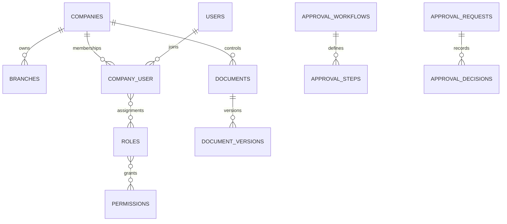

# Implementation Master Plan — Graha Pondasi ERP

Repository diterima kosong pada 21 Agustus 2026. Baseline: Laravel 13.26, PHP 8.3, MySQL 8.4 produksi, Blade/Tailwind, PHPUnit. Tidak ada legacy code/data yang dapat digunakan ulang.

> DECISION REQUIRED BPM-001: `docs/PM 04 Business Process Mapping.xls` tidak tersedia. Master command dipakai sebagai baseline sementara; mapping Level 0 belum final.

| Domain | Ada | Parsial | Belum | Masalah | Prioritas | Tindakan |
|---|---:|---:|---:|---|---|---|
| Organization/IAM | Ya | Ya | Tidak | UI CRUD lanjutan | P0 | Fase 1 |
| Approval/Document/Audit/Numbering | Ya | Ya | Tidak | parallel, quorum, signature | P0 | Fase 1-2 |
| CRM/Tender/Contract | Ya | Ya | Tidak | CRM lanjutan dan signing eksternal | P1 | Perluasan Fase 2 |
| Project/Bored Pile | Ya | Ya | Tidak | schedule/Gantt dan testing lanjutan | P1 | Perluasan Fase 3 |
| Procurement/Inventory | Ya | Ya | Tidak | PO/versioning/three-way match | P1 | Perluasan Fase 4 |
| Manufacturing/Equipment | Ya | Ya | Tidak | UI produksi dan maintenance lanjutan | P2 | Perluasan Fase 5 |
| Finance/Accounting | Ya | Ya | Tidak | AP/AR, pajak, closing UI | P1 | Perluasan Fase 6 |
| QMS/HSE | Ya | Ya | Tidak | HSE forms dan management review UI | P1 | Perluasan Fase 7 |
| Reporting | Ya | Ya | Tidak | dashboard role-based dan export | P2 | Fase 8 |

## Target dan ERD

Modular monolith; domain berkembang di `app/Domain`, shared tenancy/audit di `app/Support` dan `app/Services`. Semua transaksi wajib membawa company dan dimensi relevan.

Roadmap mengikuti delapan fase master command. Migration additive dan backward-compatible; idempotency, row locking, decimal uang, FK constraint, dan authorization backend adalah invariant.

## Log implementasi berkelanjutan

- 2026-08-21: scaffold, schema organisasi/RBAC/governance, company isolation, number sequence, approval sequential, audit hash chain, document version service, branded authentication, organization UI, dan test fondasi.
- Berikutnya: CRUD membership/role matrix, approval parallel/quorum/delegation, registry document UI dan secure download sebelum Fase 2.
- 2026-08-21: approval any/all/quorum, SLA, delegation, reject/revision engine, document registry/download isolation, serta core tender won/lost dan idempotent project conversion.
- Berikutnya: UI tender/estimating dan contract activation gate; rekonsiliasi BPM tetap menunggu workbook.
- 2026-08-21: Fase 3 core project zone/WBS/cost code, bored pile lifecycle, concrete overbreak tolerance, daily report/inspection schema, dan project closing gate.
- 2026-08-21: Fase 4 core item/UOM/warehouse/bin, immutable stock ledger, receipt/issue/transfer idempotent, negative stock prevention, purchase request dan budget gate.
- 2026-08-21: Fase 5 core BOM/production order/material traceability, equipment/hour meter, maintenance schema, fuel consumption dan anomaly flag.
- 2026-08-21: Fase 6 core COA, fiscal period, configurable mappings, balanced/idempotent journal posting, period lock, immutable posted entries dan project cost ledger.
- 2026-08-21: Fase 7 core configurable standard/clause mapping, risk/opportunity, NCR/CAPA, internal audit independence, evidence expiry dan management review schema.
- 2026-08-21: UI operasional QMS, permission backend `qms.*`, company isolation, risk scoring, NCR/CAPA dan audit independence diverifikasi; 27 test/69 assertion lulus.
- Berikutnya: Fase 8 dashboard per-role, laporan lintas domain, export, scheduler, security/performance hardening, deployment docs dan screenshot responsive.
- 2026-08-21: Fase 8 core tiga laporan terisolasi company, filter periode, CSV permission, SLA/evidence scheduler dan deployment runbook.
- 2026-08-21: runtime error audit sehat; UI manufacturing, production completion, equipment, hour meter, fuel anomaly dan maintenance work order diaktifkan.
- 2026-08-21: procurement extension vendor, versioned PO, immutable revision snapshot, goods receipt ke stock ledger dan three-way invoice matching.
- 2026-08-21: procurement UI vendor/PO/approval submission/activation gate/goods receipt/vendor invoice tersedia dengan authorization backend.
- 2026-08-21: approval center UI untuk workflow role/nominal, sequential steps, any/all/quorum, SLA, decision history dan delegation.
- 2026-08-21: automatic procurement accounting core untuk Goods Receipt (Inventory/GRNI) dan matched Vendor Invoice (GRNI/AP) memakai mapping configurable.
- 2026-08-21: accounting mapping dan idempotent procurement posting diekspos ke UI terpisah dengan permission `finance.manage`/`accounting.post`.
- 2026-08-21: signature core mengikat signer/version/hash, provider config terenkripsi, serta webhook HMAC/idempotency/replay protection.
- 2026-08-21: Digital Signing UI, permission khusus, provider configuration dan rate-limited webhook endpoint tersedia.
- 2026-08-21: progress billing core dengan contract cap, approval gate, retention, advance recovery, AR/revenue posting dan project cost dimensions.
- 2026-08-21: HSE core JSA/PTW/toolbox/incident/actions dan management review snapshot dengan company-scoped evidence.
# Pembaruan 2026-08-21 — Cash, Bank, Reconciliation

- Selesai: rekening bank terikat akun GL, penerimaan pelanggan, pembayaran vendor, statement dan rekonsiliasi.
- Selesai: fiscal period closing gate berbasis approval dan outstanding reconciliation.
- Verifikasi: `CashBankClosingTest` mencakup idempotency, outstanding cap, reconciliation, dan closing gate.

# Pembaruan 2026-08-21 — Retention Release

- Selesai: release retensi dengan approval gate, saldo cap, project row lock, idempotency, audit trail, dan balanced posting.
- Selesai: UI draft/submit/activate/post serta accounting mapping configurable.
- Verifikasi: `RetentionReleaseTest` mencakup cap, approval, balanced journal, dan duplicate posting.

# Pembaruan 2026-08-21 — Project Costing

- Selesai: ringkasan budget/RAP, actual ledger, committed PO, CTC, EAC, variance, dan contract value.
- Selesai: forecast snapshot idempotent dengan basis estimasi dan company isolation.
- Verifikasi: `ProjectCostingTest` memastikan idempotency serta kalkulasi decimal EAC/variance.

# Pembaruan 2026-08-21 — Enterprise UX Copy

- Selesai: HSE workspace menjelaskan alur JSA/permit dan incident/corrective action beserta statistik dan empty state.
- Selesai: kamus microcopy lintas modul memperluas istilah teknis dan menjelaskan tujuan bisnis setiap workspace.
- Standar berkelanjutan: `docs/UX_COPY_STANDARD.md`.

# Pembaruan 2026-08-21 — Manufacturing Control

- Selesai: workspace produksi end-to-end untuk BOM, komponen, production order, material issue, completion, traceability lot/heat, dan biaya WIP.
- Selesai: BOM tanpa komponen ditolak saat pembuatan production order.
- Selesai: material issue dan completion otomatis membentuk jurnal Raw Material → WIP → Finished Goods.
- UI menjelaskan tujuan, prasyarat, hasil stok, dan dampak jurnal setiap tindakan.

# Pembaruan 2026-08-21 — Production Quality Disposition

- Selesai: release gate QC memastikan hanya output diterima yang dapat menjadi finished goods.
- Selesai: output ditolak ditahan dan wajib diputuskan sebagai rework atau scrap dengan alasan, instruksi, PIC, waktu, serta audit trail.
- Selesai: disposition scrap membentuk jurnal seimbang Biaya Scrap / Manufacturing WIP memakai accounting mapping configurable dan idempotency key.
- Verifikasi: `ManufacturingTraceabilityTest` mencakup material issue, QC accepted/rejected, completion, scrap disposition, stock ledger, dan tiga jurnal seimbang.

# Pembaruan 2026-08-21 — Routing dan Biaya Konversi

- Selesai: master work center dengan tarif tenaga kerja dan overhead per jam.
- Selesai: routing berurutan per BOM dengan waktu standar per unit dan instruksi kerja.
- Selesai: realisasi operasi idempotent membentuk jurnal Manufacturing WIP / penyerapan labor dan overhead.
- Selesai: biaya barang jadi dan scrap memakai total material, tenaga kerja, serta overhead; variance waktu tampil terhadap routing standar.
- Selesai: routing completion gate dan final cost true-up mencegah output melewati tahap kerja atau meninggalkan residual WIP akibat partial completion.

# Pembaruan 2026-08-21 — Rekonsiliasi WIP Manufaktur

- Selesai: laporan rekonsiliasi biaya aktual ke finished goods, scrap, dan residual WIP per production order.
- Selesai: status WIP aktif dibedakan dari anomali order terminal sehingga saldo sah tidak ditandai keliru.
- Selesai: period closing menolak order terminal yang masih mempunyai residual WIP.
- Selesai: export CSV rekonsiliasi tersedia melalui permission laporan.
- Selesai: over-issue material ditolak berdasarkan kebutuhan BOM dan allowance scrap; order terminal dengan scrap ditutup otomatis.

# Pembaruan 2026-08-21 — Laporan Keuangan Formal

- Selesai: trial balance dengan saldo awal, mutasi periode, dan saldo akhir debit/kredit.
- Selesai: laba rugi berdasarkan akun revenue dan expense serta neraca berdasarkan asset, liability, equity, dan laba berjalan.
- Selesai: laporan hanya mengambil jurnal posted dan terisolasi pada perusahaan aktif.

# Pembaruan 2026-08-21 — AR/AP Aging

- Selesai: aging piutang berdasarkan progress billing posted dikurangi customer receipt posted.
- Selesai: aging utang berdasarkan vendor invoice matched dikurangi vendor payment posted.
- Selesai: bucket 0–30, 31–60, 61–90, dan >90 hari per tanggal cut-off.
- Decision required: default due date vendor invoice saat ini 30 hari; jadikan payment term configurable sebelum implementasi multi-term penuh.

# Pembaruan 2026-08-23 — Field Operations & Hardening

## Status Master (ringkas)

| ID | Domain | Requirement | Status | Test | Catatan |
|---|---|---|---|---|---|
| BPM-001 | Proses | Rekonsiliasi Business Process Mapping Level 0 | Blocked | - | File `docs/PM 04` belum tersedia di repo; baseline alur bisnis internal dipakai |
| FO-001 | Bored Pile | Master pile diperluas (koordinat, elevasi, toe/cut-off, grade, rig, PIC) | Tested | FieldOperationsTest | Kolom additive backward-compatible |
| FO-002 | Bored Pile | Drilling record + bore log lapisan ternormalisasi + verifikasi independen | Tested | FieldOperationsTest | Perekam != verifikator; kedalaman terdalam memperbarui actual_depth |
| FO-003 | Bored Pile | Concrete delivery truck: slump, accept/reject, approve = single source aktual pile | Tested | FieldOperationsTest | Recalculate overbreak vs toleransi proyek/setting |
| FO-004 | Bored Pile | Pile testing PIT/PDA/CSL/SLT/DLT + gate completed | Tested | FieldOperationsTest | Gate: scheduled harus tuntas; setting require_pile_test_pass=1 wajib ada passed |
| TAX-001 | Accounting | PPN keluaran/masukan, PPh 23/final, bukti potong dua arah | Tested | TaxIntegrationTest | Selesai sesi sebelumnya |
| SET-001 | Sistem | Company defaults editable (/admin/settings) | Tested | CompanySettingsTest | Fallback chain customer → perusahaan |
| TI-001 | Tender | Tender intelligence (peserta, kompetitor, win-rate) | Pending | - | Belum dimulai |
| PR-001 | Procurement | RFQ, bid comparison, vendor evaluation | Pending | - | Belum dimulai |
| INV-001 | Inventory | Reservation, opname, return, tools/fuel tank | Partial | - | Stok kritis alert sudah Tested; sisanya Pending |
| API-001 | API | /api/v1 field-ready foundation | Pending | - | Belum dimulai |

Log: Field Operations end-to-end (drilling/bore log ternormalisasi ADR-028, concrete delivery approval-driven ADR-029, testing gate ADR-030); README produk menggantikan README Laravel; CI quality-gate terverifikasi lengkap (composer+migrate+pint+test+build).

# Pembaruan 2026-08-23 (2) — Tender Intelligence

| ID | Domain | Requirement | Status | Test | Catatan |
|---|---|---|---|---|---|
| TI-001 | Tender | Competitor master + peserta per tender (rank/bid/winner eksklusif) | Tested | TenderIntelligenceTest | Winner tunggal di-enforce service |
| TI-002 | Tender | Win/loss rate, lost opportunity, avg vs HPS, top competitor | Tested | TenderIntelligenceTest | Formula sesuai spec; draft/cancelled/no-bid/bidding di-exclude |
| TI-003 | Tender | Kartu intel + form peserta/kompetitor di halaman tender | Tested | smoke HTTP | Label UI Bahasa Indonesia |

Catatan: loss-analysis (primary_reason, elimination_stage, lesson_learned, improvement) ternyata sudah tersedia di `tender_outcomes` sejak baseline; tidak dibuat ulang — cukup diexpose lebih lanjut pada dashboard Fase F.

# Pembaruan 2026-08-23 (3) — RFQ & Stock Opname (Fase C)

| ID | Domain | Requirement | Status | Test | Catatan |
|---|---|---|---|---|---|
| PR-RFQ-001 | Procurement | RFQ + item, nomor unik per company | Tested | RfqTest | SKU-based line input |
| PR-RFQ-002 | Procurement | Undang vendor (guard company) | Tested | RfqTest | Idempotent per pasangan rfq-vendor |
| PR-RFQ-003 | Procurement | Quotation wajib vendor terundang + item set persis | Tested | RfqTest | Upsert per vendor |
| PR-RFQ-004 | Procurement | Bid comparison (total/lead/skor) + seleksi pemenang eksklusif, RFQ auto-close | Tested | RfqTest | Loser otomatis rejected |
| INV-OPN-001 | Inventory | Stock opname draft -> approval user lain -> adjustment idempotent hanya baris bervarian | Tested | StockOpnameTest | Negative count ditolak di create |
| UI-002 | UI | Halaman /admin/procurement/rfq & /admin/inventory/opname mobile-friendly + nav | Tested | smoke HTTP | Konfirmasi irreversible pakai confirm() |

Berikutnya (Pending): material request/goods issue/return ke project-pile; tools check-out; fuel tank reconciliation; cage & casing domain penuh; API v1.
# Pembaruan 2026-08-23 (4) — Material Request -> Issue -> Project Cost

| ID | Domain | Requirement | Status | Test | Catatan |
|---|---|---|---|---|---|
| INV-MR-001 | Inventory | Permintaan material per proyek/pile + approval pemisah | Tested | MaterialRequestTest | Pemohon != approver |
| INV-MR-002 | Inventory | Issue parsial/penuh dari gudang (ledger immutable, FIFO cost terakhir) | Tested | MaterialRequestTest | Key idempotency per baris |
| ACC-MAT-001 | Accounting | Jurnal Biaya Material (D) / Gudang (K) berdimensi proyek via mapping material_issue | Tested | MaterialRequestTest | Otomatis masuk ProjectCostLedger |
# Pembaruan 2026-08-23 (5) — Material Return & API v1 Foundation

| ID | Domain | Requirement | Status | Test | Catatan |
|---|---|---|---|---|---|
| INV-RET-001 | Inventory | Pengembalian material: stok masuk dgn unit cost issue terakhir, jurnal dibalik, cost ledger dikoreksi negatif | Tested | MaterialRequestTest | Siklus material lengkap |
| API-001 | API | POST /api/v1/auth/token (Sanctum, throttle 10/mnt) | Tested | ApiV1Test | |
| API-002 | API | GET projects & bored-piles terisolasi company via header X-Company-Id | Tested | ApiV1Test | 403 lintas company |
| API-003 | API | POST daily-reports (permission project.manage) + validasi 422 konsisten | Tested | ApiV1Test | |
| API-004 | API | GET/POST material-requests (permission inventory.manage) | Tested | ApiV1Test | |

Endpoint tersedia: /api/v1/auth/token, /projects, /bored-piles, /daily-reports, /material-requests. Rate limit global 60/mnt, login token 10/mnt. Error envelope {message, errors}.
Berikutnya (Pending): cage/casing domain penuh, tools check-out, fuel tank reconciliation, dashboard role QMS/HSE, OpenAPI spec.
# Pembaruan 2026-08-23 (6) - Fuel Tank Inventory & Reconciliation

| ID | Domain | Requirement | Status | Test | Catatan |
|---|---|---|---|---|---|
| FUEL-001 | Equipment | Master tangki BBM + saldo awal | Tested | FuelTankTest | Kapasitas & code unik per company |
| FUEL-002 | Equipment | Transaksi signed (receipt/issue/adjustment) idempotent per key | Tested | FuelTankTest | Duplikat mengembalikan transaksi lama |
| FUEL-003 | Equipment | Rekonsiliasi fisik: selisih buku vs stik dicatat sebagai reading_adjustment ter-audit | Tested | FuelTankTest | Seimbang = tanpa penyesuaian |
| UI-003 | UI | Kartu stok tangki + form + konfirmasi rekonsiliasi di /admin/fuel-tanks | Tested | smoke HTTP | Nav group Engineering & Workshop
# Pembaruan 2026-08-23 (7) - Reinforcement Cage Domain

| ID | Domain | Requirement | Status | Test | Catatan |
|---|---|---|---|---|---|
| MFG-CAGE-001 | Manufacturing | Master cage: spec bar/spiral/pengaku, segmen, coupler, heat no, mill cert, lokasi | Tested | ReinforcementCageTest | Nomor unik per company |
| MFG-CAGE-002 | Manufacturing | Timbangan aktual + flag varians baja vs toleransi company (default 5%) | Tested | ReinforcementCageTest | QC lolos ditolak bila varians melebihi toleransi |
| MFG-CAGE-003 | Manufacturing | QC independen: pembuat != pemeriksa; gagal/lolos final | Tested | ReinforcementCageTest | |
| MFG-CAGE-004 | Manufacturing | Delivery cage ke titik pile siap (cleaning/inspection/cage_installation), satu cage aktif per titik | Tested | ReinforcementCageTest | Guard company di service |
| MFG-CAGE-005 | Bored Pile | Gate opsional require_cage_passed pada transisi inspection -> cage_installation | Tested | ReinforcementCageTest | Default off, toggle via Pengaturan |
| UI-004 | UI | Halaman /admin/manufacturing/cages + submenu Manufacturing Control | Tested | smoke HTTP | |
| NAV-001 | UI | Restrukturisasi menu: Finance dipadatkan (GL parent + Penagihan&Pajak parent), Supply Chain jadi parent Inventory, Equipment&Tangki digabung, Pengaturan masuk Administrasi | Tested | smoke HTTP | Sidebar lebih pendek & berhierarki
# Pembaruan 2026-08-23 (8) - Casing, Kepuasan Pelanggan, Sasaran Mutu

| ID | Domain | Requirement | Status | Test | Catatan |
|---|---|---|---|---|---|
| BP-CAS-001 | Bored Pile | Master casing (owned/rented, kondisi, siklus, biaya sewa) | Tested | smoke HTTP | Register + riwayat perpindahan |
| BP-CAS-002 | Bored Pile | Perpindahan: instalasi/ekstraksi/ditinggal/kerusakan/perbaikan/hilang dengan aturan status | Tested | smoke HTTP | Service-level transition rules |
| QMS-SAT-001 | QMS | Survei kepuasan pelanggan (mutu/jadwal/komunikasi 1-5) + rata-rata | Tested | smoke HTTP | ISO clause 9.1.2 |
| QMS-OBJ-001 | QMS | Sasaran mutu & KPI: target vs realisasi + capaian % | Tested | smoke HTTP | ISO clause 6.2 |
| NAV-002 | UI | Submenu Casing Pile di Manufacturing Control; halaman /admin/casings | Tested | smoke HTTP | equipment.view/manage
# Pembaruan 2026-08-23 (9) - OpenAPI Spec & Dashboard Role Lengkap

| ID | Domain | Requirement | Status | Test | Catatan |
|---|---|---|---|---|---|
| API-005 | API | Spesifikasi OpenAPI 3.0 publik di /docs/openapi.yaml | Tested | smoke HTTP | Token, projects, piles, daily reports, material requests |
| DASH-QHS | Dashboard | Widget NCR terbuka + CAPA lewat tenggat (qms.view) | Tested | smoke HTTP | |
| DASH-HSE | Dashboard | Widget incident terbuka + JSA aktif (hse.view) | Tested | smoke HTTP | |
| DASH-MFG | Dashboard | Widget order produksi aktif + cage menunggu QC (manufacturing.view) | Tested | smoke HTTP | |

Sisa Pending: tools check-out/in, foto evidence upload, auto-link dokumen registry, multi-currency.
# Pembaruan 2026-08-23 (10) - Tools Check-out/Check-in

| ID | Domain | Requirement | Status | Test | Catatan |
|---|---|---|---|---|---|
| INV-TL-001 | Inventory | Register alat bantu + kartu kendali keluar/masuk | Tested | smoke HTTP | Holder, expected return, riwayat |
| INV-TL-002 | Inventory | Aturan status: available -> checked_out -> available; lost final | Tested | smoke HTTP | Guard company di service
# Pembaruan 2026-08-23 (11) - Multi-currency Foundation

| ID | Domain | Requirement | Status | Test | Catatan |
|---|---|---|---|---|---|
| ACC-FX-001 | Accounting | Tabel fx_rates per company/currency/effective_date + FxService | Tested | MultiCurrencyFoundationTest | IDR selalu rate 1 |
| ACC-FX-002 | Accounting | Kolom currency pada billing/invoice/receipt/release + exchange_rate di billing | Implemented Core | - | Posting selisih kurs (realized/unrealized) masih Pending; UI input kurs menyusul |

Sisa Pending terakhir: foto evidence upload, auto-link dokumen registry, posting selisih kurs, tools foto.
# Pembaruan 2026-08-23 (12) - Foto Evidence Field Ops

| ID | Domain | Requirement | Status | Test | Catatan |
|---|---|---|---|---|---|
| FO-EV-001 | Bored Pile | Upload foto evidence untuk drilling/delivery/test (JPG/PNG/WebP max 5MB) | Tested | smoke HTTP | Whitelist MIME + size di service |
| FO-EV-002 | Bored Pile | Storage privat + download ber-authorization per company | Tested | smoke HTTP | Disk local, bukan public
# Pembaruan 2026-08-23 (13) - Auto-link Dokumen Registry

| ID | Domain | Requirement | Status | Test | Catatan |
|---|---|---|---|---|---|
| DOC-LINK-001 | Governance | Progress billing posted otomatis terdaftar di document registry (idempotent) | Tested | TaxIntegrationTest | Pola sama bisa diterapkan ke PO/MWO berikutnya
# Keputusan Signing Internal-Only (2026-08-23)

Owner memutuskan: Digital Signing memakai INTERNAL signing saja (server-side,
terikat user + versi + SHA-256) tanpa penyedia eksternal di UI agar tidak
membingungkan pengguna. Backend external adapter/webhook dipertahankan
untuk integrasi masa depan bila kelak dibutuhkan tanda tangan tersertifikasi.

Item Pending yang tersisa (di luar scope penutupan ini):
- Foto evidence untuk cage/casing/tools
- Auto-link registry untuk MWO/NCR/CAPA
- OpenAPI endpoint cages/casings/fuel-tanks/tools
- Posting selisih kurs (Decision Required: realized vs unrealized)

# Pembaruan 2026-08-23 (14) - Evidence Disk Configurable, Registry Auto-Link, FX Realized (Penutupan Backlog)

| ID | Domain | Requirement | Status | Test | Catatan |
|---|---|---|---|---|---|
| FO-EV-002 | Bored Pile | Disk evidence configurable (EVIDENCE_DISK: local/r2 S3-compatible) + kolom disk per evidence | Tested | EvidenceTypesTest | Unduhan non-local memakai temporary URL 15 menit; pratinjau inline via /field-evidence/{id}/file |
| FO-EV-003 | Field Ops | Foto evidence cage/casing/tool (upload, galeri, unduh ber-authorization) | Tested | EvidenceTypesTest | Whitelist JPG/PNG/WebP 5MB; 404 lintas company terverifikasi |
| BUG-001 | Field Ops | `FieldEvidence` tanpa import + tabel salah resolve (`field_evidence` vs `field_evidences`) — upload evidence sebelumnya selalu gagal | Fixed | EvidenceTypesTest | Bug laten dari sesi FO-EV terdeteksi saat pengujian |
| DOC-LINK-002 | Governance | MWO ditutup otomatis terdaftar di registry (alur tutup WO baru + biaya aktual) | Tested | RegistryAutoLinkTest | Guard status open; audit `equipment.mwo_closed` |
| DOC-LINK-003 | Governance | CAPA efektif + NCR tertutup otomatis terdaftar di registry (idempotent) | Tested | RegistryAutoLinkTest | Pola `Document::firstOrCreate` sama dengan billing/PO |
| ACC-FX-003 | Accounting | Posting selisih kurs REALIZED saat pelunasan kas dokumen asing (keputusan ADR-040) | Tested | FxRealizedSettlementTest | Penerimaan: gain saat kurs naik; pembayaran: loss saat kurs naik; jurnal selalu seimbang; idempotent; `fx_difference` tercatat |
| ACC-FX-004 | Accounting | Kurs dokumen: input currency/exchange_rate di billing + auto-resolve kurs invoice vendor dari PO | Implemented | FxRealizedSettlementTest | Mapping `fx_gain_credit`/`fx_loss_debit` wajib hanya untuk dokumen non-IDR |
| UI-005 | UI | Pencarian (q) + filter status tersimpan sebagai URL di daftar tender | Tested | Suite smoke | Konsisten dengan saved view projects |
| NAV-003 | UI | Aksi tutup WO + biaya di tabel Maintenance; form foto di cages/casings/tools | Tested | Suite smoke | |

Backlog sebelumnya dari commit workspace UX yang ikut diselesaikan/terverifikasi: badge batas nominal workflow config (sudah ada), saved view projects+tenders (lengkap), anti-N+1 `summariesFor()` (sudah ada). Test audit completeness diperluas (`AuditCompletenessTest::test_operational_and_fx_flows_leave_audit_trail`) mencakup event MWO/CAPA; smoke halaman tools/casings/cages/operations + saved view tender ditambahkan di `WorkspaceNavigationTest`. Unrealized FX revaluation sengaja tidak dikerjakan (ADR-040).

Verifikasi penutupan sesi: 119 tests / 420 assertions lulus, pint bersih, semua Blade terkompilasi (bug berdempet `@empty@endforelse` di 3 view diperbaiki sesuai ADR-037).

# Pembaruan 2026-08-24 - Termin Utang Vendor Configurable (ADR-043)

| ID | Domain | Requirement | Status | Test | Catatan |
|---|---|---|---|---|---|
| FIN-TERM-001 | Accounting | Jatuh tempo default invoice vendor dari company setting `default_vendor_payment_term_days` (bukan hardcoded 30 hari) | Tested | ReceivablePayableAgingTest | Setting editable di /admin/settings; dipakai aging AP |

Item "Decision required" ADR-027 selesai. Sisa terbuka hanya BPM-001 (menunggu workbook eksternal) dan unrealized FX (sengaja tidak dikerjakan per ADR-040).

# Pembaruan 2026-08-24 (2) - Integrasi Lintas Modul: BBM, Material Cage, Sewa Casing

| ID | Domain | Requirement | Status | Test | Catatan |
|---|---|---|---|---|---|
| INT-FUEL-001 | Equipment | Fuel usage equipment dapat memotong tangki BBM terpilih (issue_to_equipment, guard saldo) | Tested | FuelTankTest | Opsional — tanpa tangki perilaku lama; equipment_id/project_id tercatat di transaksi tangki |
| INV-CAGE-001 | Inventory | Konsumsi material baja fabrikasi cage: stock ledger immutable + jurnal material_issue | Tested | CageMaterialConsumptionTest | FIFO cost otomatis; ditolak setelah terkirim / nilai nihil; idempotent per cage+key |
| ACC-CAS-001 | Accounting | Pergerakan casing berbiaya → jurnal sewa (expense_debit/payable_credit configurable), idempotent per movement | Tested | CasingRentalCostTest | Biaya 0 tanpa jurnal; mapping kurang = ditolak eksplisit |
| UI-006 | UI | Form potong tangki di fuel equipment + form bebankan material di kartu cage | Tested | WorkspaceNavigationTest | Halaman cages/operations render OK |

Bug berdempet `@endforeach@endforeach` pada cages.blade.php diperbaiki (ADR-037). Verifikasi: 125 tests / 441 assertions lulus, pint bersih.

# Pembaruan 2026-08-24 (3) - Enterprise Wave: Bid Decision, Planning Support, EVM Ringkas

| ID | Domain | Requirement | Status | Test | Catatan |
|---|---|---|---|---|---|
| TEN-BID-001 | Tender | Bid/No-Bid scoring 4 faktor nyata, bobot+ambang configurable, snapshot ter-audit | Tested | BidDecisionAndPlanningTest | Margin tanpa data = Perlu Review (tidak dikarang) |
| TEN-LOSS-001 | Tender | Analitik alasan/tahap kalah per perusahaan | Tested | BidDecisionAndPlanningTest | Isolasi lintas company diverifikasi |
| PLN-CST-001 | Planning | Constraint log 9 jenis, transisi terjaga, resolusi wajib catatan | Tested | BidDecisionAndPlanningTest | Bagian baru di tab Planning |
| PRO-PLAN-001 | Procurement | Rencana pengadaan + deteksi terlambat + taut PR/PO tervalidasi | Tested | BidDecisionAndPlanningTest | Widget Pengadaan Terlambat di procurement |
| PRO-EVM-001 | Project | CPI/SPI ringkas di overview (EV/AC, EV/PV) dari data existing | Implemented Core | Suite smoke | Hanya bila AC>0; SPI butuh PV>0 |

Docs baru: docs/ENTERPRISE_GAP_ANALYSIS.md (matriks modul-gap-rencana +
keputusan blocked). Backlog besar berikutnya: budget baseline versi,
cash flow forecast, ITP/calibration/transmittal, UI redesign shell.

ADR baru: 048 (bid decision), 049 (constraint log), 050 (procurement plan),
051 (EVM ringkas).

# Pembaruan 2026-08-24 (4) - Gelombang Digital Twin Pile (Storage, Passport, As-built, Acceptance, Control Tower)

| ID | Domain | Requirement | Status | Test | Catatan |
|---|---|---|---|---|---|
| DT-STO-001 | Infra | Abstraksi object storage + StoredFile metadata registry (SHA-256) + serving privat ber-authorization | Tested | Suite storage/passport | Disk non-local = temporary URL |
| DT-PSP-001 | Bored Pile | Digital Pile Passport + QR + timeline evidence foto | Tested | Suite passport | QR publik tanpa data sensitif |
| DT-DOC-001 | Governance | As-built PDF white-label + dossier; regenerasi = versi baru di Document Registry; nomor NumberSequence (pile_as_built/pile_acceptance_dossier) | Tested | PileDocumentRegistryTest | Foto embed dari salinan preview |
| DT-ACC-001 | Bored Pile | Acceptance lifecycle pending->qa_review->engineer_review->accepted/rejected/conditional dengan gate data nyata | Tested | PileAcceptanceHandoverTest | Permission berjenjang project.manage/qms.verify/approval.decide |
| DT-EVR-001 | QMS | Evidence requirement per company default OFF, configurable min foto/kategori | Tested | PileAcceptanceHandoverTest | Backward-compatible |
| DT-HOV-001 | Project | Handover package ZIP as-built+dossier+MANIFEST.csv -> object storage -> registry versioned; exception pile belum accepted | Tested | PileAcceptanceHandoverTest | Audit handover_package_generated |
| FT-CT-001 | Bored Pile | Foundation Control Tower: KPI harian nyata, Risk Radar deterministik HEALTHY/WATCH/CRITICAL, plan view/grid, daily production board mobile | Tested | FoundationControlTest | PileRiskService deterministic (ADR-072) |

Catatan penomoran ADR: commit gelombang ini memakai nomor yang bertabrakan
dengan registry lama; registry kanonis kini di ARCHITECTURE_DECISIONS.md
(ADR-066 s.d. ADR-072).

# Pembaruan 2026-08-24 (5) - Premium App Launcher /apps

| ID | Domain | Requirement | Status | Test | Catatan |
|---|---|---|---|---|---|
| LNC-001 | UX | Stable key 10 workspace + registry config/app-launcher.php (metadata saja) | Tested | AppLauncherTest | Navigation tetap sumber href/permission |
| LNC-002 | UX | Kartu workspace cover 16:9 + deskripsi + capability preview (3 + N) + favorite + Buka | Tested | AppLauncherTest | Cover lokal WebP hasil scripts/generate-app-covers.php |
| LNC-003 | UX | Mode tampilan Visual/Compact/List + search client-side + empty state | Tested | smoke HTTP | localStorage per user; List memuat semua item+children |
| LNC-004 | UX | Custom cover per workspace via Experience Studio | Tested | AppLauncherTest | JPEG/PNG/WebP max 5MB -> GD crop 16:9 -> WebP 1200x675 disk privat |
| LNC-005 | Security | Serving cover /branding/{company}/cover-*; 404 lintas company | Tested | AppLauncherTest | MIME whitelist, tanpa SVG |
| BUG-002 | Navigation | Item parent ber-children melewati cek module visibility (edition tidak menyembunyikan workspace) | Fixed | AppLauncherTest | filterItems kini memeriksa SEMUA item (ADR-065 benar-benar berlaku) |
| LNC-006 | UX | Favorit/Recents existing dipertahankan; favorit toggle dari kartu memakai endpoint existing | Tested | AppLauncherTest | Tanpa storage baru |

Verifikasi: 198 tests / 808 assertions, pint bersih, view:cache + npm run build sukses. Screenshot matrix: public/marketing/screens/apps-launcher-{1440,768,375,dark-1440,dark-375}.png.

# Pembaruan 2026-08-24 (6) - Dashboard Premium & Standardisasi Komponen (Fasa 2-3)

| ID | Domain | Requirement | Status | Test | Catatan |
|---|---|---|---|---|---|
| UI-D1 | Dashboard | Header greeting (pagi/siang/sore/malam + tanggal ID) + CTA Semua Aplikasi | Tested | DashboardPermissionTest + smoke | Tanpa hardcode brand; token --brand-primary |
| UI-D2 | Dashboard | KPI row role-aware dengan icon chip ber-tone + hint | Tested | DashboardPermissionTest | stat-card baru backward-compatible |
| UI-D3 | Dashboard | Cockpit Eksekutif 5 KPI premium; GP otomatis merah bila negatif | Tested | smoke | valueClass prop untuk density 5 kolom |
| UI-D4 | Dashboard | Chart card premium (revenue brand-color dinamis dari token) + aging + pile | Tested | smoke | Chart.js palette ikut theme preset |
| UI-D5 | Dashboard | Project health table premium + status pill ring; procurement queue card; approvals/journal card | Tested | smoke | Badge dot-ring baru dipakai lintas modul |
| UI-C1 | Komponen | x-ui.stat-card: icon/tone/delta/valueClass; x-ui.badge: dot + ring subtle rounded-full | Tested | Suite penuh | Semua pemakaian existing tetap jalan |
| UI-C2 | CSS | Table polish (hover row, tabular-nums), focus-visible ring konsisten, scrollbar halus light/dark | Tested | Suite penuh | prefers-reduced-motion sudah ada |

Verifikasi: 198 tests / 808 assertions, pint bersih, build sukses. Screenshot: dashboard-premium-{1440,dark-1440,375}.png + finance-overview-1440.png.

# Pembaruan 2026-08-24 (7) - Fasa 6: Konsistensi Token Brand & Kebersihan Glyph

| ID | Domain | Requirement | Status | Test | Catatan |
|---|---|---|---|---|---|
| UI-C3 | Komponen | Sapu text-sky-700/600, hover:border-sky-500, bg-sky-700 -> token --brand-primary di 78 view admin | Tested | Suite penuh 198 | auth/pdf sengaja dikecualikan |
| BUG-003 | Konten | Mojibake UTF-8 (em-dash rusak) di 5 view (finance/inventory/procurement/projects/tenders) | Fixed | Suite penuh | scripts/fix-mojibake.php reusable |

White-label kini benar-benar menyeluruh: ganti preset/warna di Experience Studio mengubah aksen SEMUA halaman admin (sebelumnya sebagian terkunci sky). Verifikasi: 198 tests / 808 assertions, pint bersih, build sukses.

# Pembaruan 2026-08-24 (8) - Fasa 2 Lanjutan: Form Pattern Global

| ID | Domain | Requirement | Status | Test | Catatan |
|---|---|---|---|---|---|
| UI-F1 | Form | CSS global form: min-height 42px (touch WCAG), radius konsisten, focus ring brand, disabled state, :user-invalid merah progresif | Tested | Suite penuh | Berlaku otomatis ke SEMUA form tanpa ubah view |
| UI-F2 | Komponen | x-ui.field (label + hint + error per name) dan x-ui.form-section (title + description) | Tested | smoke | Exemplar: halaman Pengaturan |
| UI-F3 | UX | Form Settings direfaktor ke form-section + helper text per field | Tested | CompanySettingsTest + smoke screenshot settings-hub-1440.png | Nama input tidak berubah � backend aman |

Verifikasi: 198 tests / 808 assertions, pint bersih.

# Pembaruan 2026-08-24 (9) - Danger Modal Konsisten & Form Per-Modul (Penutup Fasa 2)

| ID | Domain | Requirement | Status | Test | Catatan |
|---|---|---|---|---|---|
| UI-M1 | UX | Danger-action modal global menggantikan confirm() native: 19 titik di 12 view | Tested | Suite penuh + smoke | data-confirm attribute; Esc/overlay/klik-luar menutup; focus management; form pakai requestSubmit agar validasi HTML5 tetap jalan |
| UI-F4 | Form | Form grid utama dikonversi ke x-ui.field/form-section: inventory (master+movement), operations (equipment register), procurement (vendor+draft PO), RFQ | Tested | Ledger/PO/RFQ/Workspace tests | Nama input tidak berubah; helper text per field; required marker |

Verifikasi akhir fasa UI: 198 tests / 808 assertions, pint bersih, build sukses. Screenshot: inventory-forms, procurement-forms, operations-forms, rfq-form, settings-hub.

# Pembaruan 2026-08-25 - Finance Backlog Wave 1: Arus Kas, Disposal Aset, Penyesuaian Piutang

| ID | Domain | Requirement | Status | Test | Catatan |
|---|---|---|---|---|---|
| ACC-CF-001 | Accounting | Laporan arus kas metode langsung dari mutasi riil akun kas (is_cash + rekening bank ter-GL) | Tested | FinanceBacklogWave1Test | Kategori per akun di CoA; default operating; jurnal multi-lawan dibagi proporsional; transfer antar kas net-nol diabaikan; kas akhir = saldo riil |
| ACC-FAD-001 | Accounting | Disposal aset tetap: hapus cost+akumulasi, hasil jual, gain/loss otomatis, idempotent, guard status | Tested | FinanceBacklogWave1Test | Mapping asset_disposal 5 sisi wajib lengkap; UI form + mapping drawer + badge DILEPAS |
| AR-CN-001 | Accounting | Credit note AR: Debit revenue / Kredit AR, cap sisa piutang billing, idempotent | Tested | FinanceBacklogWave1Test | Nomor CN via NumberSequence auto-create; drawer di billing index + riwayat |
| AR-WO-001 | Accounting | Write-off piutang dengan approval pemisah (self-approval dilarang), posting beban setelah approve | Tested | FinanceBacklogWave1Test | Cap outstanding saat request DAN saat approval; reject dengan catatan; audit trail |

Route +5 (cash-flow report, dispose, credit-note, write-off request/decide) tanpa menghapus route lama. Verifikasi: 254 tests / 1126 assertions lulus, pint bersih, view:cache sukses.

# Pembaruan 2026-08-25 (2) - QMS/HSE Backlog Wave 2: Kalibrasi, ITP, Observasi, PPE, KPI FR/SR

| ID | Domain | Requirement | Status | Test | Catatan |
|---|---|---|---|---|---|
| HSE-OBS-001 | HSE | Observasi keselamatan proaktif (unsafe act/condition/near-miss) open→resolved dengan verifier pemisah | Tested | HseQmsBacklogWave2Test | Nomor OBS via NumberSequence; tab baru di HSE workspace; audit trail |
| QMS-CAL-001 | QMS | Register kalibrasi alat ukur ter-link equipment + status otomatis ok/due_soon(≤30hr)/overdue | Tested | HseQmsBacklogWave2Test | Halaman /admin/calibrasi dikelompokkan per status; ISO 7.1.5 |
| QMS-ITP-001 | QMS | Inspection & Test Plan per proyek/pile: header + item (hold/witness/review) + hasil inspeksi | Tested | HseQmsBacklogWave2Test | Fail wajib catatan; pemeriksa ≠ perekam; hold point tanpa pass menahan penutupan ITP |
| HSE-PPE-001 | HSE | Register PPE keluar-masuk per personil dengan kondisi out/in | Tested | HseQmsBacklogWave2Test | Pengembalian dicatat saat ganti/berhenti |
| HSE-KPI-001 | HSE | KPI FR/SR/TRIR dari exposure log bulanan nyata (man-hours dari payroll) | Tested | HseQmsBacklogWave2Test | FR = lost-time ×1jt/jam kerja; SR = hari hilang ×1jt/jam kerja; tanpa data = tampil kosong jelas, bukan dikarang |
| NAV-004 | UI | Menu baru: Register Kalibrasi (Workshop), ITP & KPI Keselamatan (Quality & HSE), Arus Kas (GL children); ikon scale/activity/clipboard-check/trash dll ditambahkan | Tested | smoke HTTP | Edition module mapping calibrations→manufacturing |

Route +7 tanpa menghapus route lama. Verifikasi: 261 tests / 1161 assertions lulus, pint bersih. Perbaikan regresi: klasifikasi modul kalibrasi di Navigation (ADR-065 tetap berlaku), cash-flow page menampilkan empty state ramah bila akun kas belum dikonfigurasi (bukan error 500).

# Pembaruan 2026-08-25 (3) - Backlog Wave 3: Administrasi Kontrak, Downtime Equipment, Audit Diff

| ID | Domain | Requirement | Status | Test | Catatan |
|---|---|---|---|---|---|
| CON-MS-001 | Kontrak | Milestone register per kontrak (award) dengan bobot progres (total ≤ 100%) + status late otomatis | Tested | ContractAdminDowntimeWave3Test | Halaman /admin/contract-admin; achieve dengan tanggal realisasi |
| CON-INS-001 | Kontrak | Register asuransi kontrak: polis/CAR/EAR/TPL/surety, status aktif/expiring(≤30hr)/expired | Tested | ContractAdminDowntimeWave3Test | Validasi end ≥ start; audit trail |
| EQ-DT-001 | Equipment | Downtime terstruktur per alat: mulai/tutup dengan alasan breakdown/maintenance/changeover/waiting/weather | Tested | ContractAdminDowntimeWave3Test | Guard satu downtime berjalan; durasi jam dihitung; bahan OEE/availability |
| AUD-DIFF-001 | Governance | Audit diff viewer: tabel kolom lama→baru dengan highlight baris berubah | Tested | smoke HTTP | Render pada /admin/audit; fallback JSON bila bukan diff |
| BUG-004 | UI | signatures/index.blade.php rusak (baris teracak sejak admin-v3) — direkonstruksi; lint semua compiled view kini bagian verifikasi | Fixed | Suite penuh | Latent bug dari commit 508b6c0 |

Route +4 (contract-admin index/milestone/achieve/insurance + 2 downtime). Verifikasi: 264 tests / 1181 assertions lulus, pint bersih.

# Pembaruan 2026-08-25 (4) - Backlog Wave 4: Keluhan Pelanggan, NCR Supplier, Jurnal Berulang

| ID | Domain | Requirement | Status | Test | Catatan |
|---|---|---|---|---|---|
| QMS-CC-001 | QMS | Register keluhan pelanggan ISO 9.1.2: kanal/severity/status open→resolved + resolusi ter-audit | Tested | QmsFinanceWave4Test | Halaman /admin/complaints; nomor CCM via NumberSequence; isolasi lintas company |
| QMS-SUP-001 | QMS | NCR supplier: kolom vendor_id pada nonconformities, guard vendor hanya untuk source supplier | Tested | QmsFinanceWave4Test | Form NCR existing menerima vendor_id |
| ACC-RJ-001 | Accounting | Jurnal berulang: template baris seimbang, posting otomatis harian via scheduler `journals:post-recurring` 01:00 | Tested | QmsFinanceWave4Test | Idempotency key recurring:{id}:{Y-m}; fiscal-period gate; skip-and-retry bila periode tutup; toggle pause/aktif; run-now manual |
| BUG-005 | Accounting | Query jatuh tempo next_run_at gagal di SQLite (date cast menyimpan komponen jam) — bandingkan dengan end-of-day datetime | Fixed | QmsFinanceWave4Test | |

Route +6 tanpa menghapus route lama. Verifikasi: 269 tests / 1200 assertions lulus, pint bersih.

# Pembaruan 2026-08-25 (5) - Backlog Wave 5: Budget vs Aktual per Akun, Transmittal Dokumen

| ID | Domain | Requirement | Status | Test | Catatan |
|---|---|---|---|---|---|
| FIN-BUD-001 | Accounting | Budget vs aktual per akun per periode fiskal: variance + usage % + flag OVER (revenue under-target = over) | Tested | BudgetsTransmittalsWave5Test | Halaman /admin/account-budgets; updateOrCreate per kombinasi akun+periode |
| DOC-TRM-001 | Governance | Transmittal distribusi dokumen: header penerima/metode/status sent→acknowledged + item versi dokumen dari registry | Tested | BudgetsTransmittalsWave5Test | Nomor TRM via NumberSequence; guard versi lintas company; audit trail |

Route +6 (budget index/store/delete + transmittal index/store/acknowledge) tanpa menghapus route lama. Verifikasi: 272 tests / 1219 assertions lulus, pint bersih.

# Pembaruan 2026-08-25 (6) - Backlog Wave 6: Gate ITP Pile Completion + Reminder Kalibrasi

| ID | Domain | Requirement | Status | Test | Catatan |
|---|---|---|---|---|---|
| BP-ITP-002 | Bored Pile | Gate opsional require_itp_hold_points_passed: hold point tanpa pass menahan transisi pile ke completed | Tested | GateReminderWave6Test | Default OFF (backward-compatible); setting baru di CompanySetting::DEFAULTS |
| QMS-CAL-002 | QMS | Reminder kalibrasi otomatis `qms:notify-calibration` harian 07:30: overdue + due ≤30 hari, sekali per record/hari | Tested | GateReminderWave6Test | Pola OperationalNotification sama dengan qms:notify-due |

Verifikasi penutupan sesi: 274 tests / 1226 assertions lulus, pint bersih.
